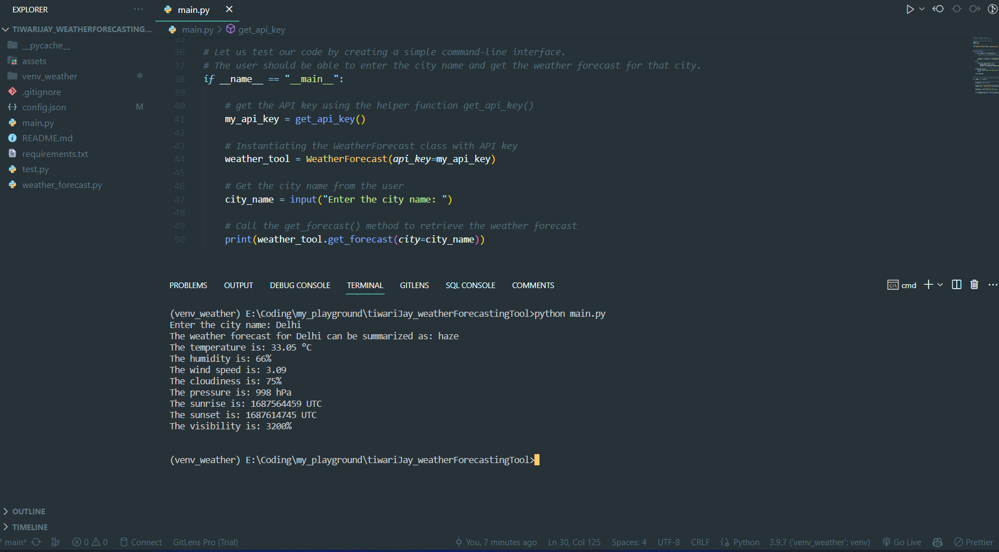

# mAwsome: A Weather Forecasting CLI Tool

mAwsome is an awesome command-line tool for retrieving the current weather forecast using the OpenWeatherMap API.

## Table of Contents

- [mAwsome: A Weather Forecasting CLI Tool](#mawsome-a-weather-forecasting-cli-tool)
  - [Table of Contents](#table-of-contents)
  - [Features](#features)
  - [Snapshot](#snapshot)
  - [Architecture Diagram](#architecture-diagram)
  - [Requirements](#requirements)
  - [Installation](#installation)
  - [API Key Setup](#api-key-setup)
  - [Usage](#usage)
  - [Security Note](#security-note)


## Features

- Retrieves the current weather forecast for a given city
- Displays relevant weather information such as temperature, humidity, and weather conditions

## Snapshot
Following is the screenshot of the working product:



## Architecture Diagram 
Following is the architecture diagram of the tool:

Weather Forecasting Tool Architecture Diagram:

```
[Command-Line Interface] --> [API Communication Module] --> [Data Parsing Module] --> [Display Weather Forecast]
```                            

- Command-Line Interface: The user interacts with the tool through the command line. It accepts user input for the city name and displays the weather forecast.

- API Communication Module: Handles the communication with the OpenWeatherMap API. It sends requests to retrieve weather data for the specified city and receives the response.

- Data Parsing Module: Parses the received weather data from the API response. It extracts relevant information such as temperature, humidity, and weather conditions.

The Command-Line Interface interacts with the API Communication Module to request weather data for a specific city. The API Communication Module communicates with the OpenWeatherMap API and receives the weather data. This data is then passed to the Data Parsing Module, which extracts the required information. 


## Requirements

- Python 3.9 or above
- OpenWeatherMap API key (see 'API Key Setup' below)

## Installation

1. Clone the repository:
```
git clone https://github.com/Fastest-Coder-First/tiwariJay_weatherForecastingTool
```

2. Create a virtual environment:
```
python3 -m venv myvenv
```
3. Activate the virtual environment:
- For Windows:
  ```
  myvenv\Scripts\activate
  ```
- For macOS/Linux:
  ```
  source myvenv/bin/activate
  ```
4. Install the required dependencies:
```
pip install -r requirements.txt
```


## API Key Setup

To use the Weather Forecasting Tool, you need to obtain an API key from OpenWeatherMap. Follow these steps:

1. Go to the OpenWeatherMap website: [https://openweathermap.org/](https://openweathermap.org/).
2. Sign up for a free account or log in if you already have one.
3. Navigate to the API keys section and generate a new API key.
4. Copy the API key and store it securely. Avoid hard-coding api key in the code. You can set upy API key in folowing two ways:
   1. Using config.json, if it is present in the root directory of the project. The config.json file should have the following structure:
      ```
      {
        "OPENWEATHER_API_KEY": "<your_api_key>"
      }
      ```
      You can set you API key in the config.json file and the tool will automatically pick it up.

   2. By setting an environment variable as shown below:

    To set environment variables is by using the command line before running your Python script. The exact command varies depending on the operating system:

    ### Windows (Command Prompt):
    ```
    set OPENWEATHER_API_KEY=<your_api_key_without_quotes>
    python main.py
    ```
    [Note: No quotes or spaces around equal(=) sign.]

    ### Windows (PowerShell):
    ```
    $env:OPENWEATHER_API_KEY = "<your_api_key>"
    python main.py
    ```

    ### MacOS / Linux:
    ```
    OPENWEATHER_API_KEY="<your_api_key>" python main.py
    ```

## Usage

1. Ensure that you have activated the virtual environment (see Installation section above).
2. Run the tool: `python main.py`
3. Enter the name of the city for which you want to retrieve the weather forecast when prompted.
4. The tool will make a request to the OpenWeatherMap API and display the current weather forecast for the specified city.


## Security Note

Ensure that you keep your API key secure and avoid committing it to a public repository. You can use environment variables or configuration files to store and access the API key securely. See the 'API Key Setup' section above for more details.

<!-- ## Usage of Github Copilot in this project

### Code Generation and Completion: 
[ I consider my self as a beginner in app development and following is my experiece with Github Copilot for creating this CLI tool. ]

- Github Copilot immensely helpepd in generating the code for this project. 
- Starting from importing required libraries to making class `WeatherForecast()`, function `get_forecast()`. It even handled the API communication module, data parsing, and errr handling. Awesome! I just had to give prompts in the form of comments and Github Copilot generated the code for me. I just had to do `Tab/Ctrl+RightArroww` + `Enter` for most of the part. I just had to think about the overall structure of the tool, and copilot took care of the syntactical details.

### Documentation assistance:
- The biggest relief was the assistance in creating the gigantic README file. As soon as I started writing the headers, it started the contect accurately for most of the part.  

### Time/effort savings and Overall Experience:
- Although I had no experience with CLI tool development and very minimial experience with git and GitHub, I was able to create a working MVP in less that 3-4 hours, with the help of Chat GPT and Github Copilot. I am not sure how much time I would have taken otherwise, if I had to write the code from scratch. May be a day, or a week, god knows. 

- This is a game changer! -->


